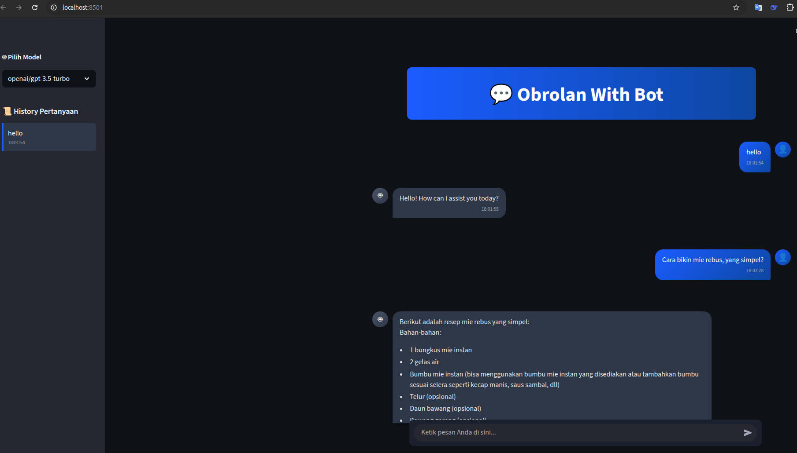

# Obrolan With Bot

ini adalah aplikasi fun project 2 💬 Obrolan With Bot.

<p style="color: red;">Catatan : API tidak/jangan di push ke github!!!</p>

## Screenshots

Halaman Utama


## Run Locally

Clone the project

```bash
  git clone https://github.com/khu9utsu/fun_project_2_REAID
```

Go to the project directory

```bash
  cd fun_project_2_REAID
```

create API

```bash
  https://openrouter.ai
  copy api ke .streamlit/secrets.toml
```

Install dependencies

```bash
  pip install streamlit
```

Start the server

```bash
  streamlit run app.py
```

## Demo

http://localhost:8501/

## Aplikasi

https://fun-project-2-reaid-andri-purnama.streamlit.app/
